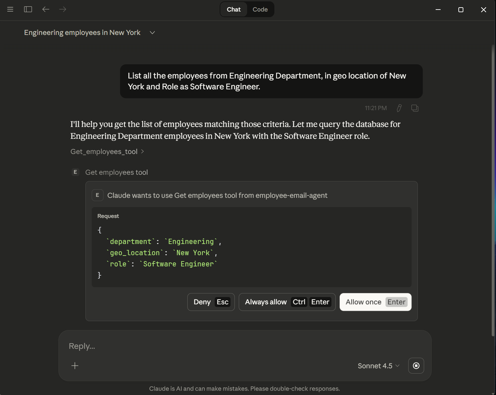

I have local MCP server running through cli as:

(multi-agents) PS C:\Personal\codews\multi-agents\employee_email_agent> uv run .\mcp_server.py

How to I add this to Claude desktop as Local MCP Server?

10:24 PM
To add your local MCP server to Claude Desktop, you need to edit the Claude Desktop configuration file. Here's how:

Steps:
Locate the config file based on your OS:
Windows: %APPDATA%\Claude\claude_desktop_config.json
macOS: ~/Library/Application Support/Claude/claude_desktop_config.json
Linux: ~/.config/Claude/claude_desktop_config.json
Edit the configuration file to add your MCP server. Since you're on Windows (based on your PowerShell prompt), open:
   C:\Users\YourUsername\AppData\Roaming\Claude\claude_desktop_config.json
Add your server configuration. Here's an example format:
json
{
  "mcpServers": {
    "employee-email-agent": {
      "command": "uv",
      "args": ["run", "C:\\Personal\\codews\\multi-agents\\employee_email_agent\\mcp_server.py"],
      "env": {}
    }
  }
}
Important notes:

Use double backslashes (\\) in Windows paths within JSON
The command should be the executable (uv in your case)
The args array contains the arguments you'd normally pass to that command
Make sure uv is in your system PATH, or use the full path to the uv executable
If your script needs the virtual environment activated, you might need to adjust the command
Restart Claude Desktop completely for the changes to take effect.
Verify the server is connected by looking for it in the MCP tools menu (usually indicated by a 🔌 or hammer icon in the interface).
Would you like help troubleshooting if it doesn't connect, or do you need to configure any environment variables for your server?


__init__.py
3 lines

py


agent.py
116 lines

py


mcp_server.py
63 lines

py


claude_desktop_config.json
5 lines

json

I have the following files for my agent and for the mcp server. I have invoked mcp server using cli:
(multi-agents) PS C:\Personal\codews\multi-agents\employee_email_agent> uv run .\mcp_server.py

But after restating cluade desktop, I don't see any MCP Server configured. Where is the issue?

10:30 PM
I can see the issue! Your claude_desktop_config.json file is missing the mcpServers configuration. You only have preferences in there, but no server definitions.

Let me also check your MCP server code for any issues first:


Check the mcp_server.py file for issues
I found two issues:

Issue 1: Missing MCP Server Configuration
Your claude_desktop_config.json needs the mcpServers section added.

Issue 2: Code Bug in mcp_server.py
On line 43, you're defining a function send_email that shadows/overwrites the imported send_email function from line 7. On line 59, when you call send_email(...), it will recursively call itself instead of the actual implementation!

Let me create the corrected files for you:


Created 2 files, read a file
Summary of Fixes:
1. Updated claude_desktop_config.json:

Added the mcpServers section with your employee-email-agent configuration
Configured to use uv run with the full path to your mcp_server.py
2. Fixed mcp_server.py:

Changed from agent import get_employees, send_email to from agent import get_employees, send_email as send_email_impl (line 7)
Renamed the MCP tool function from send_email to send_email_tool (line 43)
Updated the call on line 59 to use send_email_impl instead
Next Steps:
Replace your current files with the corrected versions
Copy the claude_desktop_config.json to: %APPDATA%\Claude\claude_desktop_config.json (typically C:\Users\YourUsername\AppData\Roaming\Claude\claude_desktop_config.json)
Completely quit and restart Claude Desktop (not just close the window - use Task Manager if needed to ensure it's fully closed)
Look for the 🔌 icon or MCP indicator in the Claude Desktop interface
The key issues were the missing configuration and the function name collision that would have caused infinite recursion!

Claude desktop config
Code · JSON 
Mcp server
PY 
I am getting pop which says "MCP employee-email-agent: Server disconnected. For trouble shooting guidance, please visit our debugging documentation"

10:39 PM
This error means Claude Desktop is trying to connect to your MCP server but failing. Let's troubleshoot this step by step.

Common Issues and Solutions:
1. Check if uv is in your PATH
Open a new PowerShell window and run:

powershell
uv --version
If this fails, you need to either:

Add uv to your system PATH, OR
Use the full path to uv.exe in your config
To find where uv is installed:

powershell
Get-Command uv
2. Update config with full path to uv (if needed)
If uv isn't in PATH, update your config like this:

json
{
  "preferences": {
    "sidebarMode": "chat"
  },
  "mcpServers": {
    "employee-email-agent": {
      "command": "C:\\Users\\YourUsername\\.cargo\\bin\\uv.exe",
      "args": [
        "run",
        "C:\\Personal\\codews\\multi-agents\\employee_email_agent\\mcp_server.py"
      ],
      "env": {}
    }
  }
}
3. Test your MCP server manually
Before configuring Claude Desktop, test if your server runs correctly:

powershell
cd C:\Personal\codews\multi-agents\employee_email_agent
uv run .\mcp_server.py
The server should start and wait for input (it won't print anything initially - that's normal for stdio transport).

4. Check for missing dependencies
Your MCP server might be missing dependencies. Check if you have a pyproject.toml or requirements.txt file. Your server needs:

fastmcp
google-adk (or whatever package provides google.adk.agents)
5. Add the virtual environment path
Since you're using (multi-agents) virtual environment, try specifying it explicitly:

json
{
  "preferences": {
    "sidebarMode": "chat"
  },
  "mcpServers": {
    "employee-email-agent": {
      "command": "uv",
      "args": [
        "run",
        "--directory",
        "C:\\Personal\\codews\\multi-agents\\employee_email_agent",
        "mcp_server.py"
      ],
      "env": {}
    }
  }
}
```

### 6. **Check Claude Desktop Logs**

To see detailed error messages, check the logs:

**Windows logs location:**
```
%APPDATA%\Claude\logs\
Look for the most recent log file and search for errors related to "employee-email-agent".

Debugging Steps:
Try this first:

Test the command manually from any directory:
powershell
   uv run C:\Personal\codews\multi-agents\employee_email_agent\mcp_server.py
If that works, use this simplified config:
json
   {
     "preferences": {
       "sidebarMode": "chat"
     },
     "mcpServers": {
       "employee-email-agent": {
         "command": "uv",
         "args": [
           "run",
           "C:\\Personal\\codews\\multi-agents\\employee_email_agent\\mcp_server.py"
         ]
       }
     }
   }
Restart Claude Desktop completely
Can you share:

What happens when you run uv run .\mcp_server.py manually?
Any error messages from the Claude Desktop logs?
The output of uv --version?
This will help me pinpoint the exact issue!

I checked in logs. It is failing for the packages:
2026-02-09T04:43:03.017Z [employee-email-agent] [info] Server started and connected successfully { metadata: undefined }
2026-02-09T04:43:03.078Z [employee-email-agent] [info] Message from client: {"method":"initialize","params":{"protocolVersion":"2025-06-18","capabilities":{"extensions":{"io.modelcontextprotocol/ui":{"mimeTypes":["text/html;profile=mcp-app"]}}},"clientInfo":{"name":"claude-ai","version":"0.1.0"}},"jsonrpc":"2.0","id":0} { metadata: undefined }
Traceback (most recent call last):
  File "C:\Personal\codews\multi-agents\employee_email_agent\mcp_server.py", line 1, in <module>
    from fastmcp import FastMCP
ModuleNotFoundError: No module named 'fastmcp'
2026-02-09T04:43:03.123Z [employee-email-agent] [info] Server transport closed { metadata: undefined }
2026-02-09T04:43:03.123Z [employee-email-agent] [info] Client transport closed { metadata: undefined }
2026-02-09T04:43:03.124Z [employee-email-agent] [info] Server transport closed unexpectedly, this is likely due to the process exiting early. If you are developing this MCP server you can add output to stderr (i.e. console.error('...') in JavaScript, print('...', file=sys.stderr) in python) and it will appear in this log. { metadata: undefined }
2026-02-09T04:43:03.124Z [employee-email-agent] [error] Server disconnected. For troubleshooting guidance, please visit our [debugging documentation](https://modelcontextprotocol.io/docs/tools/debugging) { metadata: { context: 'connection', stack: undefined } }
2026-02-09T04:43:03.124Z [employee-email-agent] [info] Client transport closed { metadata: undefined }

Show more
10:44 PM
Perfect! The issue is clear now - fastmcp is not installed in the environment that uv run is using.

The Problem:
When you run uv run .\mcp_server.py, uv needs to know what dependencies to install. It looks for a pyproject.toml or requirements.txt file to understand what packages are needed.

Solution:
You need to create a pyproject.toml file in your project directory to declare your dependencies.


Created a file, read a file
Steps to Fix:
Save the pyproject.toml file to your project directory:
   C:\Personal\codews\multi-agents\employee_email_agent\pyproject.toml
Sync dependencies (optional but recommended):
powershell
   cd C:\Personal\codews\multi-agents\employee_email_agent
   uv sync
Test the server manually:
powershell
   uv run .\mcp_server.py
It should now start without errors (just wait for input - that's normal).

Restart Claude Desktop completely.
Alternative: If you already have a virtual environment
If you want to use your existing (multi-agents) virtual environment instead, you can modify the Claude config to activate it first:

json
{
  "preferences": {
    "sidebarMode": "chat"
  },
  "mcpServers": {
    "employee-email-agent": {
      "command": "powershell",
      "args": [
        "-Command",
        "cd C:\\Personal\\codews\\multi-agents\\employee_email_agent; .\\..\\..\\Scripts\\Activate.ps1; python mcp_server.py"
      ]
    }
  }
}
But using uv with pyproject.toml is cleaner and more portable.

Try the pyproject.toml approach first - it should resolve the ModuleNotFoundError immediately!

Pyproject
TOML 
My config is:

{
  "preferences": {
    "sidebarMode": "chat"
  },
  "mcpServers": {
    "employee-email-agent": {
      "command": "powershell",
      "args": [
        "-Command",
        "cd C:\\Personal\\codews\\multi-agents; .venv\\Scripts\\Activate.ps1; cd .\\employee_email_agent\\; uv run .\\mcp_server.py"
      ],
      "env": {}
    }
  }
}

The log says the following error:

uv : The term 'uv' is not recognized as the name of a cmdlet, function, script file, or operable program. Check the 
spelling of the name, or if a path was included, verify that the path is correct and try again.
At line:1 char:93
+ ... s; .venv\Scripts\Activate.ps1; cd .\employee_email_agent\; uv run .\m ...
+                                                                ~~
    + CategoryInfo          : ObjectNotFound: (uv:String) [], CommandNotFoundException
    + FullyQualifiedErrorId : CommandNotFoundException

Show more
10:55 PM
The issue is that uv is not available in the PowerShell session that Claude Desktop spawns. Since you're activating your virtual environment, you don't actually need uv - you can just run Python directly!

Updated Config:

Created a file, read a file
Explanation:
Instead of:

Changing directory
Activating the virtual environment
Changing directory again
Running uv run
We're now:

Changing to your project directory
Running Python directly from the .venv using the full path
This is simpler and avoids the need for uv to be in PATH.

Test it manually first:
Before updating Claude Desktop config, test this command in PowerShell:

powershell
cd C:\Personal\codews\multi-agents\employee_email_agent; ..\.venv\Scripts\python.exe .\mcp_server.py
If that works, then update your Claude Desktop config and restart Claude Desktop completely.

Alternative (even simpler):
If you want to avoid PowerShell altogether, you can use the Python executable directly:

json
{
  "preferences": {
    "sidebarMode": "chat"
  },
  "mcpServers": {
    "employee-email-agent": {
      "command": "C:\\Personal\\codews\\multi-agents\\.venv\\Scripts\\python.exe",
      "args": [
        "C:\\Personal\\codews\\multi-agents\\employee_email_agent\\mcp_server.py"
      ],
      "env": {}
    }
  }
}
This is the cleanest approach - it runs Python directly with the full path to your script. Try this one first!

Claude desktop config fixed
Code · JSON 
yes..it is integrated. But I don't see the any special button in interface. Also, how do I test the new mcp server?

11:01 PM
Great! Your MCP server is now connected. Let me explain how to see and test it.

How to See Your MCP Server in the Interface:
Look for the hammer/tools icon (🔨) in the chat input area. When you click it, you should see your available MCP tools:

get_employees_tool
send_email_tool
The icon typically appears near the bottom of the chat interface, close to where you type messages.

How to Test Your MCP Server:
Just chat naturally with me! Your MCP server tools are now available to me. Let me test them right now:

Test 1: Get employees from Sales department Can you show me all employees in the Sales department?

Test 2: Get employees by location Show me all Engineering employees in the US.

Test 3: Get employees by role Find all Software Engineers.

Try asking me one of these questions, and I'll use your MCP server tools to fetch the data from your SQLite database. You can also ask me to:

"Find all employees in the Engineering department located in EU"
"Get all Sales Managers"
"Show me employees in HR"
"Send an email to all Sales employees in the US about the quarterly meeting"
The beauty of MCP is that you just ask naturally, and Claude (me) will automatically use the appropriate tools from your server to help you!

Go ahead and ask me to find some employees - let's test it! 🚀


2026-02-09T05:12:06.750Z [employee-email-agent] [info] Message from client: {"method":"tools/call","params":{"name":"send_email_impl","arguments":{"name":"Alice Johnson","email":"alicejohnson@company.com","subject":"Request to Organize Meeting - New AI Initiatives Launch","body":"Hi Alice,\n\nI hope

pasted

When I request to send email, I see the following error:

11:14 PM
I see the issue! There's still a naming conflict in your mcp_server.py. The problem is that when you use @app.tool decorator with a function named send_email_impl, FastMCP is wrapping it into a FunctionTool object, which then overwrites the imported send_email_impl function.

Let me fix the mcp_server.py file:


Created a file, read a file
What Changed:
Line 7-8: Changed the imports to use clear, unique aliases:

python
from agent import get_employees as get_employees_from_db
from agent import send_email as send_email_to_employee
Line 58: Now calls send_email_to_employee instead of send_email_impl:

python
return send_email_to_employee(name, email, subject, body)
```

This ensures there's no naming conflict when FastMCP creates the `FunctionTool` wrapper.

## Steps to Fix:

1. **Replace** your current `mcp_server.py` with this fixed version:
```
   C:\Personal\codews\multi-agents\employee_email_agent\mcp_server.py
Restart Claude Desktop completely (fully quit and reopen)
Test again by asking me to send an email!
The error happened because the @app.tool decorator was turning your function into a FunctionTool object, which then shadowed the imported send_email_impl function, making it uncallable. This fix uses distinct names to avoid that collision.

Mcp server fixed
PY 
GetEmployees.png

README.md
123 lines

md

Please update the read me file with the following:
1.) steps to create mcp server
2.) Steps to add local MCP Server  in Claude desktop
3.) Demo in Claude desktop after adding Local MCP Server. Use the prompt "List all the employees from Engineering Department, in geo location of New York and Role as Software Engineer."  and give reference of attached image. The image would be in the same folder as readme.md.

11:43 PM

Viewed 2 files, created a file, read a file
I've updated your README.md file with comprehensive MCP server setup instructions. The new section includes:

What's Added:
🔌 MCP Server Setup for Claude Desktop - Complete section with:
Step-by-step instructions to create mcp_server.py
Full code implementation with proper imports and tool definitions
Dependency installation guide
Configuration Instructions for:
Windows (with proper path formatting)
macOS/Linux
Important notes about paths and JSON formatting
Demo Section featuring:
The exact prompt you requested: "List all the employees from Engineering Department, in geo location of New York and Role as Software Engineer."
Reference to the GetEmployees.png screenshot
Additional example queries users can try
Explanation of how Claude interacts with the MCP tools
Troubleshooting Section with:
Log locations for all platforms
Common debugging steps
Manual testing instructions
Updated Project Structure showing:
mcp_server.py location
GetEmployees.png in the structure
Auto-generated employees.db
The documentation is now complete and ready for users to follow along and integrate your employee email agent with Claude Desktop!

Readme
Document · MD 


Want to be notified when Claude responds?


Claude is AI and can make mistakes. Please double-check responses.
Readme · MD
Copy

# ADK Sample Agent Project

This repository contains a reference implementation for a local LLM agent built using the Google ADK (Agent Development Kit) and LiteLLM. It is configured to run efficiently using uv for dependency management and Ollama or OpenAI models depending on the agent.

## 🚀 Quick Start

### Prerequisites
* uv installed on your system.
* Ollama running locally with the `gemma3` model pulled (for agents that use Ollama).
* OpenAI API key configured in your environment (for agents that use OpenAI models, e.g. `employee_email_agent`).

## ADK Agent Setup Guide

This guide outlines the steps to initialize a project, install dependencies, and configure a basic LLM agent using the Google ADK and LiteLLM.

### 1. Project Initialization

Run the following commands in your terminal to create the project directory and set up the environment using uv.

```bash
mkdir agentdir
cd agentdir
uv init
uv add google-adk
uv add litellm  
adk create sample_agent
```

### 2. Configure the Agent (agent.py)

Locate the agent.py file within your project and use the following code to define your agent. This example utilizes the gemma3 model via Ollama for the sample agent.

```python
from google.adk.agents.llm_agent import Agent
from google.adk.models.lite_llm import LiteLlm

root_agent = Agent(
    model=LiteLlm('ollama/gemma3'),
    name='root_agent',
    description='A helpful assistant for user questions.',
    instruction='Answer user questions to the best of your knowledge',
)
```

### 3. Register the Agent (__init__.py)

To ensure the agent is recognized by the ADK, add the agent's name to the __init__.py file:

```text
__all__ = ["root_agent"]
```

### 4. Running the Agent

You can execute your agent using either the command line or a web-based interface.

#### Via Terminal

```bash
adk run sample_agent/
```

#### Via Web Interface

```bash
adk web
```

## Employee Email Agent

A new agent, `employee_email_agent`, has been added to this repository. It drafts employee-facing emails (announcements, reminders, onboarding messages) using ADK + LiteLLM with an OpenAI model.

### Purpose

- Generate professional, concise internal emails from a short prompt (purpose, audience, tone, required points).

### Location

- The agent lives in `employee_email_agent/` and includes `agent.py` and `__init__.py`.

### Quick Run

From the repository root run:

```bash
adk run employee_email_agent/
```

### Implementation note

The `employee_email_agent` is configured to use an OpenAI model via LiteLLM. Make sure your OpenAI credentials are set in the environment before running this agent.

### Example agent snippet (matches `employee_email_agent/agent.py`):

```python
from google.adk.agents.llm_agent import Agent
from google.adk.models.lite_llm import LiteLlm

email_agent = Agent(
    model=LiteLlm('openai/gpt-5'),
    name='employee_email_agent',
    description='Queries SQLite DB for employees by department + geography + role and sends emails.',
    instruction='Generate a professional internal email tailored to the provided purpose, audience, and tone.',
)
```

### Notes

- Review generated drafts before sending. The agent assists with writing but does not replace human review.
- If you need to customize templates or add more examples, edit `employee_email_agent/agent.py` and add tests or sample prompts.

## 🔌 MCP Server Setup for Claude Desktop

The `employee_email_agent` can be exposed as a Model Context Protocol (MCP) server, allowing Claude Desktop to directly query the employee database and send emails through natural language commands.

### Step 1: Create the MCP Server

Create a file named `mcp_server.py` in the `employee_email_agent/` directory:

```python
import uvicorn
from fastmcp import FastMCP
from typing import List, Dict, Any, Optional

from agent import get_employees as get_employees_from_db
from agent import send_email as send_email_to_employee

app = FastMCP(
    name="Employee Email Agent MCP Server",
    instructions="""
    Use get_employees_tool to find employees by department (e.g. Sales, Engineering), 
    geo_location (e.g. US, New York, EU), and/or role.
    Any parameter can be left out (pass None or omit) to get broader results.
    
    Only call send_email_tool when the user explicitly asks to send an email or clearly confirms.
    
    Always present the list of found employees (names and emails) in a clear, readable way 
    before suggesting to send email.
    Be professional, polite, and confirm before sending any message.
    """)

@app.tool
def get_employees_tool(
    department: Optional[str] = None,
    geo_location: Optional[str] = None,
    role: Optional[str] = None
) -> List[Dict[str, Any]]:
    """
    Fetches employees from the database based on optional filters.
    Args:
        department (str, optional): The department to filter employees by.
        geo_location (str, optional): The geographical location to filter employees by.
        role (str, optional): The role to filter employees by.
    Returns:
        List[Dict[str, Any]]: A list of dictionaries containing employee names and emails.
    """
    return get_employees_from_db(department, geo_location, role)

@app.tool
def send_email_tool(
    name: str,
    email: str,
    subject: str,
    body: str
) -> str:
    """
    Simulates sending an email to an employee.
    Args:
        name (str): The name of the email recipient.
        email (str): Email address to send to.
        subject (str): The subject of the email.
        body (str): The body content of the email.
    Returns:
        str: A confirmation message indicating the email was sent.
    """
    return send_email_to_employee(name, email, subject, body)

if __name__ == "__main__":
    app.run(transport="stdio")
```

### Step 2: Add FastMCP Dependency

Make sure `fastmcp` is added to your project dependencies. Add it to your `pyproject.toml` or install it using:

```bash
uv add fastmcp
```

### Step 3: Configure Claude Desktop

**For Windows:**

1. Locate the Claude Desktop configuration file:
   ```
   %APPDATA%\Claude\claude_desktop_config.json
   ```
   (Typically: `C:\Users\YourUsername\AppData\Roaming\Claude\claude_desktop_config.json`)

2. Edit the file to add the MCP server configuration:

```json
{
  "preferences": {
    "sidebarMode": "chat"
  },
  "mcpServers": {
    "employee-email-agent": {
      "command": "C:\\Path\\To\\Your\\.venv\\Scripts\\python.exe",
      "args": [
        "C:\\Path\\To\\Your\\employee_email_agent\\mcp_server.py"
      ],
      "env": {}
    }
  }
}
```

**For macOS/Linux:**

1. Locate the Claude Desktop configuration file:
   ```
   ~/Library/Application Support/Claude/claude_desktop_config.json  # macOS
   ~/.config/Claude/claude_desktop_config.json                      # Linux
   ```

2. Edit the file to add the MCP server configuration:

```json
{
  "preferences": {
    "sidebarMode": "chat"
  },
  "mcpServers": {
    "employee-email-agent": {
      "command": "/path/to/your/.venv/bin/python",
      "args": [
        "/path/to/your/employee_email_agent/mcp_server.py"
      ],
      "env": {}
    }
  }
}
```

**Important Notes:**
- Replace `C:\\Path\\To\\Your\\` with the actual path to your project
- Use double backslashes (`\\`) in Windows paths within JSON
- Use the full path to your virtual environment's Python executable
- Ensure all paths are absolute, not relative

### Step 4: Restart Claude Desktop

Completely quit and restart Claude Desktop for the changes to take effect. The MCP server should now be connected and available.

### Step 5: Verify Connection

After restarting Claude Desktop:
1. Look for the 🔨 (hammer/tools) icon in the chat interface
2. Click it to see available tools
3. You should see `get_employees_tool` and `send_email_tool` listed

### Testing the MCP Server

You can test your MCP server manually before integrating with Claude Desktop:

```bash
cd employee_email_agent
python mcp_server.py
```

The server should start and wait for input (this is normal for stdio transport).

### Demo: Using the MCP Server in Claude Desktop

Once configured, you can interact with the employee database directly through Claude Desktop using natural language:

**Example Query:**
```
List all the employees from Engineering Department, in geo location of New York and Role as Software Engineer.
```

**Claude's Response:**

Claude will automatically use the `get_employees_tool` to query your database and display the results. You'll see:

1. Claude recognizes the query and requests permission to use the MCP tool
2. A tool usage dialog appears showing the parameters being sent
3. Claude presents the results in a clear, readable format



**Additional Example Queries:**
- "Show me all Sales employees in the US"
- "Find all Marketing Managers"
- "List employees in the HR department"
- "Send an email to all Engineering employees in EU about the team meeting"

The MCP integration allows Claude to seamlessly interact with your local employee database without requiring you to manually format queries or use specific commands.

### Troubleshooting

If the MCP server doesn't connect:

1. **Check Logs:** View Claude Desktop logs at:
   - Windows: `%APPDATA%\Claude\logs\`
   - macOS: `~/Library/Logs/Claude/`
   - Linux: `~/.config/Claude/logs/`

2. **Verify Python Path:** Ensure the Python executable path is correct and accessible

3. **Test Manually:** Run the MCP server directly to check for errors:
   ```bash
   python employee_email_agent/mcp_server.py
   ```

4. **Check Dependencies:** Ensure all required packages are installed:
   ```bash
   uv sync
   ```

5. **Review Documentation:** Visit [MCP Debugging Documentation](https://modelcontextprotocol.io/docs/tools/debugging) for more help

## 📂 Project Structure

```
agentdir/
├── pyproject.toml      # Project dependencies managed by uv
├── sample_agent/
│   ├── __init__.py     # Exports the agent to the ADK
│   └── agent.py        # Contains agent definitions and instructions
├── employee_email_agent/
│   ├── __init__.py     # Exports the employee email agent
│   ├── agent.py        # Generates employee-facing emails using OpenAI
│   ├── mcp_server.py   # MCP server for Claude Desktop integration
│   ├── GetEmployees.png # Demo screenshot
│   └── employees.db    # SQLite database (auto-generated)
└── ...
```